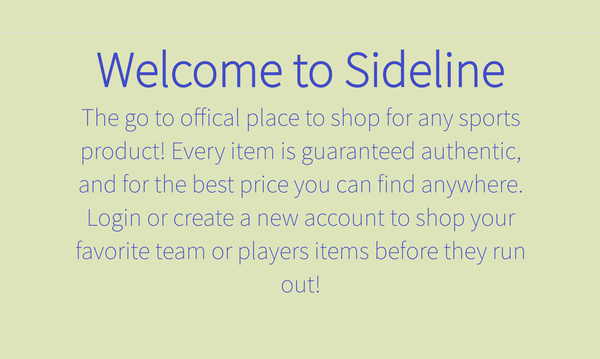

<h1 align="center">Sideline Shop</h1>


  
<br />
## Description

Sideline shop is a e-commerce inspired web application that is based on sports. The application has several features that were implemented such as Authentication using JWT, Paypal checkout, a cart component, and ability to view previous purchases. Along with JWT, there is also an admin feature, which allows the user to create, read, update, and delete posts, also with the ability to view every purchase every made on the web app.

## ADMIN LOGIN
Use the admin credentials to create, delete, update, or view any product, or you can make your own account to be able to test the shop for yourself

- user: admin@sideline.com
- password: 12345678

## PURCHASE USING PAYPAL
To check out in the cart, use the credentials below to simulate a purchase. You are then able to view your orders in the 'history' tab

- user: sb-i43ett6526353@personal.example.com
- password: 12345678


## Table of Contents
- [Description](#description)
- [License](#license)
- [Installation](#Installation)

Run the command in the root of the directory to make sure you have all depenedencies, which can be found in the package.json file. Also make sure to install them in the client folder as well. 


```
npm install 
```
## ! When running the app, the server and the client need to be running concurrently in order to work !
## Usage
You will need two terminals: 

Run the command in the root of the directory to launch db server and react app
change directory into client and start react app
```
 cd client/ npm start
```
at the root of the directory, run command
```
node server.js
```
## Development
Want to contribute? Great!

To fix a bug or enhance an existing module, follow these steps:

- Fork the repo
- Create a new branch (`git checkout -b improve-feature`)
- Make the appropriate changes in the files
- Add changes to reflect the changes made
- Commit your changes (`git commit -m 'Improve feature'`)
- Push to the branch (`git push origin improve-feature`)
- Create a Pull Request 


## License

<br />
This application is covered by the MIT license. 
## Contributing
Eddie Ibarra
<br />
:octocat: Find me on GitHub: [ibarrasb](https://github.com/ibarrasb)<br />
<br />
✉Email me with any questions: eddieibarra43@gmail.com<br /><br />